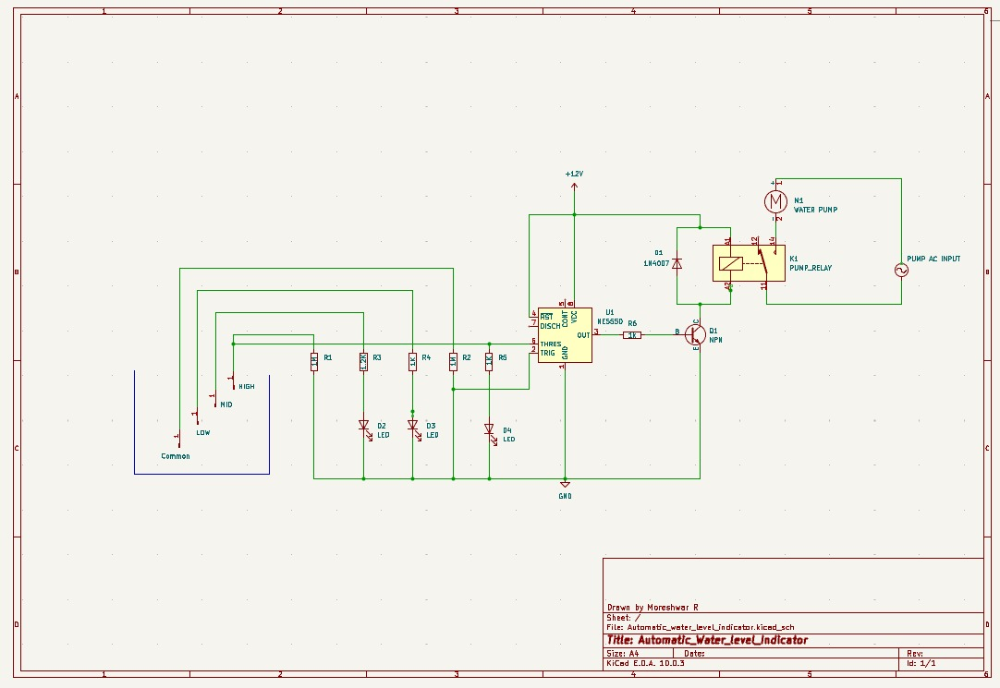

# Automatic Water Level Indicator and Motor Control using BJT

### Overview

Manual monitoring of water tanks often leads to overflow and wastage. This project solves that with a fully analog, automatic system — microcontroller-free circuit.

- Detects water levels at **25%, 50%, 75%, and 100%** using copper wire probes
- Automatically **starts the motor** when the tank is empty
- Automatically **stops the motor** when the tank is full — preventing overflow
- Provides **visual feedback** via LEDs at each level (50%, 75%, 100%)
- Built entirely with analog components — **NE555 timer**, **BC547 BJT**, and a **relay**
- Simulated on Falstad before hardware implementation on a perforated board

---

### How It Works

Copper wire probes placed at four heights inside the tank act as sensors. Water conducts current between the common (GND) probe and each level probe when submerged, triggering the corresponding circuit stage.

- **Motor ON** — when the tank is empty, Pin 2 (trigger) of the 555 is pulled low, output goes HIGH, BJT saturates, relay energises, motor starts
- **50% / 75%** — respective LEDs light up; motor continues running
- **Motor OFF** — at 100%, Pin 6 (threshold) exceeds 2/3 Vcc, timer resets, output goes LOW, BJT cuts off, relay de-energises, motor stops

| Level | 555 Output | BJT | Relay | Motor |
|-------|-----------|-----|-------|-------|
| Empty / 25% | HIGH | Saturation | Energised | ON |
| 50% | HIGH | Saturation | Energised | ON |
| 75% | HIGH | Saturation | Energised | ON |
| 100% | LOW | Cut-off | De-energised | OFF |

---

### Circuit Diagram

> Designed in KiCad 10.0.3

---

### Components

| Component | Value | Role |
|-----------|-------|------|
| BJT | BC547 (NPN) | Switch to drive the relay |
| Timer IC | NE555D | Bistable control logic |
| Relay | 6V, 5-pin | Isolates control from motor circuit |
| Diode | 1N4007 | Back-EMF protection for relay coil |
| LEDs | Blue, Pink, Yellow | Level indication at 50%, 75%, 100% |
| Resistors | 1 kΩ, 10 kΩ | Current limiting |
| Water Pump | DC 12V | Controlled load |
| Probes | Copper wire | Level sensing electrodes |
| Supply | 12V DC | Powers full circuit |

---

### Simulation

Validated using [Falstad Circuit Simulator](https://www.falstad.com/circuit/) before hardware build.

- Empty → motor ON, no LEDs
- 25% → motor ON, no change
- 50% → LED 1 (blue) ON
- 75% → LED 2 (pink) ON
- 100% → LED 3 (yellow) ON, motor OFF

> Screenshots available in `simulation/`

---

### Hardware

**Breadboard** — initial assembly to validate all connections and circuit behaviour.

**Perforated board (soldered)** — permanent build with all components soldered. 1N4007 diode placed across relay coil. Tested successfully with real water.

> Photos available in `hardware/`

---

### Results

- Level detection accurate at all four thresholds
- Motor starts and stops automatically without manual intervention
- LEDs indicate levels clearly with no false triggers
- Minor sensitivity variation observed with different water quality (copper probes)

---

### Future Scope

- IoT integration for remote monitoring and mobile control
- Dry-run motor protection
- Battery backup for power failures
- Solar-powered operation
- Water usage tracking and analytics

---

### References

- Boylestad & Nashelsky, *Electronic Devices and Circuit Theory*, Pearson, 11th Ed., 2016
- Salivahanan & Suresh Kumar, *Electronic Devices and Circuits*, McGraw Hill, 4th Ed., 2017
- [CircuitDigest — Water Level Indicator](https://circuitdigest.com/electronic-circuits/simple-diy-water-level-indicator-alarm-circuit)
- [TutorialsPoint — BJT](https://www.tutorialspoint.com/bipolar-junction-transistor)

---
